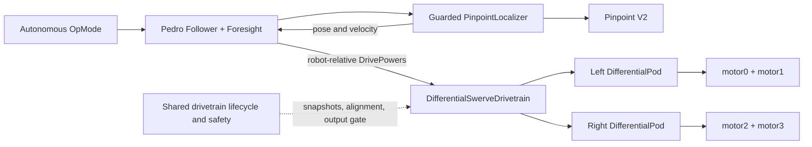

# Pedro differential-swerve implementation plan

## Implementation status — September 21, 2026

The software described here is implemented in the Phoenix repository and has been reviewed and hardened against this plan. The current source inventory, verification commands/results, and remaining robot-only gates are maintained in [INTEGRATION_STATUS.md](../Phoenix-Force-10100-Differential-Swerve/INTEGRATION_STATUS.md). [README.md](README.md) explains how to verify both repositories together.

Normal robot builds still use published Pedro 3.0.1. An explicit `-PpedroLocalArtifacts=PATH` mode now verifies the local built JAR/AAR without importing this checkout's Gradle plugins or publishing over Maven artifacts. Library runtime behavior has not been forked. The rest of this document records the original inspected baseline and design; measured physical acceptance is still required.

Corrections established by implementation: Foresight 3.0.1 advances at the parametric endpoint without waiting for terminal pose/velocity constraints, so diagnostics independently assess terminal accuracy. Full clockwise rotation with both pods forward requests **positive hardware ticks/s on all four motors** after the right-pod negate-and-swap; logical wheel directions are still left-forward/right-reverse. Autonomous live tuning is checked against the combined cap at every output preparation. A selected-pod diagnostic also requires fresh hub snapshots and cleanup protection.



The localizer supplies feedback; it does not directly command the drivetrain. Within each update the sequence is validated hub snapshot → Pinpoint update and validation → follower calculation → differential-swerve commands. Each pod wraps the existing tested controller and encoder tracker.

Recommended decision: consume published Pedro 3.0.1, implement a robot-owned `Drivetrain` and `DifferentialPod implements SwervePod`, and encapsulate the current drivetrain lifecycle. Keep the proven differential control math. Do not instantiate Pedro's current generic `Swerve` for this robot.

At the original planning baseline this document made no robot changes. The implementation status above supersedes that historical state.

## 1. Inspected baseline and evidence

Inspection date: September 21, 2026.

| Repository | Inspected revision | Working tree observations |
|---|---|---|
| `C:\Users\preco\OneDrive\Documents\GitHub\PedroSwerving` | `c94c144d217c99b9e3e4b1026756896f75d14c9a` | Version 3.0.1; initially clean |
| `C:\Users\preco\OneDrive\Documents\GitHub\Phoenix-Force-10100-Differential-Swerve` | `7b39aa67f2ae50bcc79bc5d275b5c5312e59e994` | `PinpointEncoderDirectionTest.java` and `PinpointPoseTest.java` exist as untracked user files; preserve them |

Inspected the robot's controller, kinematics, TeleOp lifecycle, encoder tracker, alignment controller, snapshot reader, tuning, hardware constants, unit tests, build files, project design, and both Pinpoint diagnostics. The supplied report of completed low-speed testing takes precedence over older documentation that still describes some powered commissioning as pending.

Key source findings:

- `DifferentialSwerveTeleOp` contains important lifecycle behavior that is not yet a reusable subsystem: port validation, zero/BRAKE initialization, INIT alignment, fresh Start seeding, whole-hub reads, age checks, recovery interlocks, PIDF updates, and exhaustive cleanup.
- `DifferentialSwervePodController` already implements the correct steering polarity, 3° reversal hysteresis, measured-rate damping, steering slew limiting, cosine-squared drive reduction, and steering headroom. Reuse it.
- `DifferentialSwerveKinematics.update()` accepts normalized forward/right translation but **clockwise angular velocity in rad/s**, not normalized turn power.
- Pedro `Follower` takes `(Localizer, Drivetrain, Algorithm)`. This is the 3.x API: `follow(Path)`, `setPose(Pose)`, `Paths.line/curve`, and `.constant/.linear` heading interpolation. Do not use older examples containing `FollowerBuilder`, `followPath`, or `setStartingPose` without a deliberate separate compatibility layer.
- Pedro `Follower.stop()` only changes follower state. It does not immediately send a motor stop. Its first no-argument update uses a zero algorithm delta time.
- Pedro `PinpointLocalizer` maps X/Y directly to Pedro X/Y and constructs a field-frame `Velocity`. It does not check Pinpoint READY/fault status or finiteness. Its constructor calls `reset()` and `update()`; `reset()` sleeps 500 ms even for `ResetMode.NONE`.
- `ForesightConfig.timeoutConstraint` is evaluated in **milliseconds**, not seconds. Required braking and velocity configuration cannot be omitted.

### Compatibility verification performed for this plan

1. All local `core` Java sources compiled successfully with `javac --release 8` into a temporary directory.
2. All local `core` and `revhub` Java sources compiled together successfully against cached FTC `RobotCore:12.0.0`, `Hardware:12.0.0`, and Android API 30. Only Java 8 obsolescence warnings were emitted.
3. Downloaded published 3.0.1 source archives from Maven Central into a temporary directory. Every local Java source was present and matched its published counterpart after line-ending normalization, including `SwervePod` and the Pinpoint classes.
4. Inspected the published REV Hub AAR metadata: `minCompileSdk=1`, `minAndroidGradlePluginVersion=1.0.0`, `coreLibraryDesugaringEnabled=false`.

These are source/API and artifact checks, not a Gradle APK build, on-device test, or proof of physical direction settings. Complete those in the phases below.

## 2. Dependency and build strategy

**Use `implementation 'com.pedropathing:revhub:3.0.1'` in the robot's `TeamCode/build.gradle`.** Maven Central is already configured. The REV Hub POM exposes `core:3.0.1` transitively and also brings `kotlin-stdlib:2.3.21`; FTC SDK dependencies in the Pedro source are compile-only. Keep all robot FTC modules at 12.0.0 and inspect the resolved graph for accidental version changes.

The official Quickstart names this same release. During this inspection the versioned POMs were available from Maven Central; the equivalent Dairy paths and REV Hub metadata returned HTTP 404. Use Central and pin the exact release. Sources: [published REV Hub POM](https://repo.maven.apache.org/maven2/com/pedropathing/revhub/3.0.1/revhub-3.0.1.pom), [published core POM](https://repo.maven.apache.org/maven2/com/pedropathing/core/3.0.1/core-3.0.1.pom), [official Quickstart dependencies](https://raw.githubusercontent.com/Pedro-Pathing/Quickstart/master/build.dependencies.gradle).

| Concern | Actual state | Resolution |
|---|---|---|
| FTC SDK | Both checkouts specify 12.0.0 | No SDK upgrade or duplicate Pinpoint driver is required |
| Java | Both modules target Java 8; combined source probe passed | Retain Java 8 source/target; robot's build daemon JDK 21 is a separate setting |
| Gradle/AGP | Robot: Gradle 9.1.0, AGP 8.13.2. Pedro: Gradle 9.0.0, AGP 8.7.3 | Consume artifacts; do not import Pedro's wrapper, root plugins, Kotlin plugin, or version catalog |
| Android API | Robot compile 30, min 24, target 28; Pedro compile 35, min 24 | Producer compileSdk 35 alone does not force consumer compileSdk 35. Published AAR metadata and source probe support retaining 30; verify transitive AAR metadata and D8 in the actual build |
| Kotlin transitive library | Published REV Hub POM includes stdlib 2.3.21 | Keep it initially; robot AGP 8.13.2 includes Kotlin 2.3 support. Do not add a Kotlin compilation plugin to Java TeamCode |
| Swerve hardware API | Generic class behavior conflicts with robot requirements | Reuse its interface, not its runtime implementation |
| Older Pedro sample code | API names and path types differ | All new examples compile against pinned 3.0.1 |

AGP 8.13's documented baseline is Gradle 8.13 and JDK 17; 8.13.2 adds Kotlin 2.3 support. This does not itself certify the robot's existing Gradle 9.1 combination. First build the unmodified baseline; if the existing toolchain fails, isolate that failure before attributing it to Pedro. A separate fallback is to standardize the wrapper on the documented Gradle 8.13 baseline while preserving FTC settings, only if an actual toolchain failure warrants it. [Android compatibility reference](https://developer.android.com/build/releases/agp-8-13-0-release-notes?hl=en).

Do not add `com.pedropathing:tuning` or copy the Quickstart wholesale initially. Its stock drivetrain/tuning assumptions have not been audited for differential steering or subsystem isolation.

Alternatives considered:

- **Source vendoring/adapted modules:** unnecessary now because the matching published API exists. If a later library fix truly requires a fork, use explicit `pedro-core` Java-library and `pedro-revhub` Android-library modules with the robot's plugins, original package names/licenses, and recorded upstream SHA/patches. Never package both those classes and the matching published artifacts.
- **Included build pointing to the neighboring checkout:** avoid machine-specific paths and independently configured Android/publishing plugins in the robot build.
- **Loose copied classes in TeamCode:** avoid duplicate `com.pedropathing` classes and unclear provenance.

Expected normal build-file change: `TeamCode/build.gradle` only, plus Gradle dependency verification metadata if the project adopts it. No source changes in the Pedro repository are needed for this design.

## 3. Coordinate contract and kinematics

Define one explicit robot frame: X forward, Y left, positive yaw CCW. At field heading zero, robot forward is field +X and left is field +Y. At other headings, the localizer reports field coordinates, not permanently robot-relative distances. Pedro's allocator already rotates field corrections by negative robot heading before constructing `DrivePowers`; do not rotate them again in the drivetrain. [Pedro coordinate reference](https://pedropathing.com/docs/pathing/reference/coordinates).

| Boundary | Conversion |
|---|---|
| Pinpoint pose → Pedro | X → X, Y → Y; read inches and radians; no axis swap |
| Pedro forward → existing kinematics | `forward = powers.forward()` |
| Pedro left strafe → existing kinematics | `right = -powers.strafe()` |
| Pedro normalized CCW turn → existing kinematics | `omegaCW = -powers.turn() * 2 * MAX_WHEEL_SPEED_METERS_PER_SECOND / TRACK_WIDTH_METERS` |
| Tracker angle/rate | Keep existing CW-positive values internally |
| Published generic swerve wheel-space angle → tracker target | `targetCW = wrap(pi/2 - wheelTheta)` |

The last conversion is necessary because the checked-out generic `Swerve` creates wheel vectors in `(right, forward)` order: straight forward has vector angle pi/2, not zero. Preserve this explicit `SwervePod` adapter convention even though the robot uses a different drivetrain. `getAngle()` returns the encoder-frame CW angle; `adjustThetaForEncoder(theta)` converts wheel space into that same frame. The new drivetrain converts a kinematics target back to `wheelTheta = pi/2 - targetCW` before calling `move()`. Do not apply the conversion twice or negate the existing steering PD again.

Pod-center offsets returned by `getOffset()` use the interface's odometry convention `(forward, left)`, in inches:

- Left: `(0, +7.0767716535)`.
- Right: `(0, -7.0767716535)`.
- Spacing: 359.5 mm = 14.1535433071 in. Radius: 179.75 mm.

Useful sign assertions, with aligned forward pods:

- Positive forward: both logical pods drive forward; hardware right-pod common velocity is negated.
- Positive strafe: both wheels turn toward robot left, corresponding to tracker angle -pi/2.
- Positive turn: left logical wheel reverses, right logical wheel advances, producing CCW chassis rotation.
- Heading +pi/2 and robot-forward motion: field +Y increases; robot-left motion produces field -X.

No field-origin offset is required for relative tests. A competition start pose may use the standard field origin; set it once with `follower.setPose(start)` after Pinpoint calibration. Do not apply the FTC-field-coordinate conversion example to Pinpoint data that is already configured to this frame.

## 4. Robot-owned drivetrain and pod design

### `DifferentialPod implements com.pedropathing.revhub.drivetrains.SwervePod`

One instance exclusively controls the two drive-motor handles for its pod, plus its analog handle, read-only quadrature handle, `SwervePodEncoder`, `PodAlignmentController`, and `DifferentialSwervePodController`. Hardware is acquired for the owning drivetrain OpMode and injected; the pod must not independently acquire or refresh every hub.

Implement the exact published methods: `name()`, `getOffset()`, `getAngle()`, `adjustThetaForEncoder(double)`, `move(double,double,boolean)`, `setToFloat()`, **`setToBreak()`** (the interface's actual spelling), and `debug()`.

Add robot lifecycle methods for alignment stepping, fresh sample acceptance, Start seeding, output preparation/commit, and immediate `safeZero()`. All nonzero output requires a valid runtime authorization for the current snapshot and lifecycle phase. Diagnostic alignment authorization is separately bounded; an autonomous follower cannot bypass it by directly calling `move()`.

Responsibilities:

1. Preserve the existing calibration gate, analog validation, independent forward references, and INIT alignment controller. Seed the tracker from residual analog angle plus raw quadrature counts at Start. Use quadrature only for runtime feedback; analog remains startup/diagnostic/recovery validation, never continuous correction.
2. Convert the incoming wheel angle once, then call the existing pod controller with measured CW angle/rate and the snapshot interval. Keep the initial 90° reversal decision, 87°/93° hysteresis, and nonnegative cosine-squared alignment factor.
3. Keep `steering = -(Kp * error - Kd * measuredRate)`, steering slew, clamp, and remaining drive headroom. Do not add Pedro's average cosine scaling on top.
4. Convert normalized logical motor commands to ticks/s using the existing 2781.083333 ticks/s full-scale value. Continue `RUN_USING_ENCODER`, FORWARD SDK direction on all four motors, and existing PIDF.
5. Left hardware: `motor0 = logicalLeft * maxTicks`, `motor1 = logicalRight * maxTicks`. Right hardware: `motor2 = -logicalRight * maxTicks`, `motor3 = -logicalLeft * maxTicks`. Keep this negate-and-swap mapping in exactly one place.
6. `ignoreAngleChanges=true` suppresses steering explicitly; it must clear pending slew output rather than merely setting angle error to zero and leaving measured-rate damping active. Zero drive plus this flag issues true zero to both motors. For nonzero drive, retain the safe alignment policy while steering is suppressed; normal autonomous will not use this combination.
7. `safeZero()` bypasses slew and alignment, calls `stopOutput()`, clears pending commands, and independently attempts zero velocity on both motors. One failure must not suppress attempts on the other pod.
8. `setToBreak()` sets BRAKE on both drive motors. `setToFloat()` is available only after zero output in an explicit disabled maintenance state; an active autonomous call is rejected and stopped, never silently honored. This policy is explicit and unit-tested.
9. Diagnostics expose target/actual/error, CW rate, raw counts, analog voltage, reversal choice, drive/steer components, logical and hardware targets, measured velocity, saturation, snapshot age, and fault state. Add a read-only reversal getter to the controller if needed; do not duplicate its decision logic.

### `DifferentialSwerveDrivetrain implements Drivetrain`

Implement all interface methods: `drive(DrivePowers, boolean)`, `maxScaling(current, delta)`, `stop()`, `stop(boolean)`, `debug()`, and velocity interpolation; retain or explicitly test acceleration interpolation.

- `drive()` validates finite input, consults the runtime gate, converts frames, uses existing kinematics, prepares **both** pods' outputs, validates limits/age, then writes outputs. A preparation or delivery exception latches a fault and attempts to stop every motor.
- Preserve common normalization of the two wheel vectors and target-axis retention for a zero-speed pod. At a completely zero chassis request, issue safe zero and retain targets; do not automatically turn the pods. Powered angle hold belongs to the bounded static-angle test, not emergency stop.
- BRAKE remains set throughout INIT, FOLLOW, HOLD, MANUAL, zero commands, faults, and Stop. `stop(false)` must not introduce FLOAT while armed. Explicit maintenance float is a separate disabled operation.
- Use the existing kinematics for actual wheel commands. Implement a small pure helper for the allocator's **unnormalized linear** vectors: left `(f - t, s)` and right `(f + t, s)` in forward/left coordinates. Do not call the stateful, normalizing `kinematics.update()` from `maxScaling()`.
- `maxScaling` returns the greatest feasible lambda in [0,1] for each `|a + lambda*b| <= 1`, intersected across both pods and the turn limit. With `A=b·b`, `B=2a·b`, `C=a·a-1`, use the feasible interval/exit root; handle zero delta, roundoff, boundary-inward requests, and invalid current powers explicitly. For feasible current powers and nonzero A, the exit root is `(-B + sqrt(B*B - 4*A*C))/(2*A)`; intersect with [0,1] and `abs(current.turn + lambda*delta.turn) <= turnLimit`. If delta is zero, preserve feasibility without dividing by zero. An infeasible/nonfinite current state is a rejected command, not an opportunity to amplify the delta. Choosing the smallest nonnegative root blindly can return zero for a valid inward request from the boundary.
- Model the wheel envelope here; the existing pod controller remains the final authority for changing steering demand and motor headroom. Report saturation rather than pretending the allocator knows future steering effort.
- Use positive-radius elliptical `interpolateVelocity(xRadius,yRadius,theta)` as in Pedro swerve; inherit/test `Drivetrain.interpolateAcceleration`. Reject invalid radii and nonfinite results in configuration validation.

Why not subclass generic `Swerve`? Its constructor sets FLOAT, its autonomous `drive()` sets FLOAT, and `stop(true)` subsequently calls `pod.setToFloat()`. It also applies average cosine scaling, uses a wheel-space convention that needs careful conversion, and calculates allocator vectors through a translation-clipping path. Most behavior would need overriding. A focused robot-owned drivetrain is easier to verify and keeps upstream dependencies untouched.

Do not enable X-lock. The current generic zero-input branch rotates a zero-magnitude rotation vector, so it does not reliably establish a useful lock heading. More fundamentally, two left/right pods cannot produce a four-corner X. Parallel lateral wheel axes can resist one direction while permitting another; they are not a full planar lock. Default stop is zero velocity plus BRAKE, with no commanded azimuth motion.

## 5. Shared lifecycle, safety, and localization

Extract the hardware lifecycle into `DifferentialSwerveRuntime`, scoped to a single OpMode. It owns the pair of pods, required hubs, snapshots, timing, output authorization, and fault state. It does not own unrelated mechanisms. Update `PROJECT_DESIGN.md` to explicitly permit this subsystem-scoped encapsulation while keeping OpModes responsible for acquisition/lifetime and user interaction.

States: `NEW → ALIGNING → READY → ARMED → STOPPED`; failures enter `FAULT_LATCHED`. Pinpoint readiness is an additional autonomous arming gate. Maintenance FLOAT is accessible only when disarmed and explicitly requested.

Preserve these current guarantees:

- Four motors start at zero, FORWARD direction, BRAKE, RUN_USING_ENCODER; validate Control Hub ports 0–3 and separate Expansion Hub quadrature ports 0/1.
- Save prior hub cache modes and use MANUAL bulk caching. One coordinator refreshes all required hubs; use the existing SDK bulk-read behavior and verify cached getters do not create a second sample.
- Failed reads invoke zero on the first failure **before** retrying. Preserve three attempts, a 150 ms recovery budget, 10 ms pauses, Stop cancellation, whole-attempt validity, and hub identity logging from `HubSnapshotReader`.
- Preserve the 250 ms feedback/control delay limit, including read recovery and Pinpoint/follower work. Check both sample-to-sample interval and sample age immediately before committing commands. Same-thread detection cannot interrupt an already blocked SDK call; retain SDK Stop behavior and test the observed failure response rather than promising an independent real-time watchdog.
- Preserve alignment tolerance 2°, continuous settle 100 ms, timeout 5 s, completed-pod drift checks, early-Start handling, and fresh Start residual-angle seeding. Stop always cancels alignment.
- Preserve tuning validation and changed-value PIDF application. Track one source of angle/rate truth in each encoder tracker.
- Preserve recovery analog/quadrature comparison within 10°, without reseeding. TeleOp keeps neutral-stick recovery and its skipped transition cycle.
- **Autonomous recovery policy:** any recovered runtime hub read also cancels the path, clears controller outputs, and latches stopped until OpMode restart. Autonomous has no neutral-stick consent to resume. Do not continue with old path/controller state after a communication interruption. INIT recovery may continue only under the existing valid alignment rules and deadlines.
- Stop every motor even after a partial initialization or another stop failure; restore every captured cache mode independently; close must be idempotent. Preserve the original exception and report cleanup failures.

`GuardedPinpointLocalizer implements Localizer` composes the published `PinpointLocalizer` and holds the same SDK driver handle for status inspection. It delegates pose/velocity conversion and checks that every update completed within the cycle budget, status is READY, and all pose/velocity components are finite. Validate before returning state to Foresight. Throw a typed feedback fault on failure; the guarded follower catches it, cancels following, zeros the drivetrain, and latches the run. Do not publish old cached values as a successful fresh update.

Only one `pinpoint.update()` runs per follower cycle, through the delegate. Pinpoint I2C acquisition is separate from Lynx motor bulk snapshots. `getFrequency()` describes device processing frequency, not host packet freshness; an unchanged pose while stationary is normal and is not a stale-packet detector. Use SDK error/status reporting and host transaction timing. Review the SDK 12 V2 CRC/error-detection support during implementation and preserve its tested behavior; there is no requirement to invent a device timestamp that the API does not expose.

Construct the delegate with `ResetMode.NONE` while outputs are disabled, so its unavoidable 500 ms constructor wait cannot stall active driving. After pod alignment has finished, zero all motors, perform the intentional stationary Pinpoint reset/calibration, and poll READY with Stop cancellation and a proposed 3 s deadline. Abort if calibration does not finish. Never recalibrate a moving robot or every time a path begins. At Start, revalidate pod alignment/readiness, seed from the fresh snapshot, set the known start pose, and arm.

If calibration must be retried, require a fresh stationary INIT sequence. Runtime `reset()` is disallowed while armed. `setPose()` for the initial start and explicit future relocalization must update Pinpoint and the delegate consistently and must not silently reset the IMU.

`SafePedroFollower extends Follower` supplies the normal API while enforcing the shared cycle:

1. `update()` begins a fresh runtime cycle and computes a positive monotonic delta from the Start/previous sample.
2. Call `super.update(delta)` once; this performs the guarded localizer update and actual Pedro algorithm/drivetrain work.
3. Recheck safety/Stop at the output boundary; catch runtime faults and stop immediately. End a cycle that produced no new drive request with safe zero, including the follower's FOLLOW-to-HOLD transition, so a prior command cannot survive merely because a branch skipped `drive()`.
4. Override `update(double)` too, so explicit-delta callers cannot bypass freshness or safety. Document that hardware age uses the runtime clock, independent of caller-supplied algorithm delta.
5. Override `stop()` to change Pedro state and send immediate safe zero. `PedroAutoDrive.close()` still stops motors even if follower/localizer operations fail.

`PedroAutoDrive` is a convenience lifecycle owner/factory: construct inside `try/finally`, initialize alignment/localization, expose a `Follower`, arm with a start pose, expose fault information, and close. Its constructor must not leave powered hardware behind on failure; defer hardware setup into cleanup-protected `initialize()`.

## 6. Configuration: known, proposed, and deliberately unverified

Keep hardware geometry/names in `HardwareConstants`, pod calibration in `SwervePodEncoder`, and existing motor/steering gains in `SwerveTuning`. New configurations reference these rather than copying values.

### Known and ready to encode now

| Value | Setting |
|---|---|
| Motor names | `motor0`, `motor1`, `motor2`, `motor3` in their existing order |
| Runtime quadrature | `encoderleft`, `encoderright`; Expansion Hub channels 0/1; 4096 raw counts/pod revolution; signs +1/+1 |
| Absolute references | `absencleft`: 0.122 V / 13.725°; `absencright`: 0.258 V / 29.025° |
| Analog signs/scale | -1/-1; 3.2 V nominal; accept finite 0..3.3 V with existing endpoint clamping |
| Pod spacing and wheel | 359.5 mm spacing; 63.25 mm wheel diameter |
| Gear ratio | `(16/54) * (50/19)` = approximately 0.779727 |
| Motor velocity base | 1150 RPM, 145.1 ticks/rev, 2781.083333 ticks/s |
| Theoretical wheel speed | Approximately 2.96961 m/s = 116.91383 in/s; not a measured loaded speed |
| Motor configuration | SDK direction FORWARD; RUN_USING_ENCODER; BRAKE; right negate-and-swap |
| Existing velocity PIDF | P=15, I=0.5, D=0.5, F=`32767/MAX_MOTOR_TICKS_PER_SECOND` |
| Existing steering | P=0.5, D=0.01, max command=0.20, slew=2.0/s; preserve current tuning source |
| Alignment gains | P=0.005 per degree, minimum=0.03, maximum=0.20 |
| Pinpoint identity | `pinpoint`, Control Hub I2C port 1, V2, two `goBILDA_4_BAR_POD` devices |
| Pinpoint offsets | `xPodOffset=+199.25`, `yPodOffset=+88.0`, `offsetUnits=MM` |
| Pose units | `globalDistanceUnit=INCH`; heading/rates radians and rad/s |
| Resolution | Preset 4-bar pod type; `ticksPerUnit=OptionalDouble.empty()`; set `encoderResolutionUnit=MM` explicitly for any later custom value |

The Pinpoint X offset is the sideways location of the **forward** pod; Y offset is the forward location of the **strafe** pod. Their positive signs are confirmed by the SDK 12 driver's documented convention. Do not confuse these offsets with the drive-pod positions.

### Explicit placeholders and arming gates

`PinpointSettings` holds the commissioned X/Y directions and `COUNTERCLOCKWISE_POSITIVE` heading convention. The current robot uses FORWARD/FORWARD. Factory construction/arming rejects uncommissioned direction/heading settings. Pod azimuth calibration remains a separate, already verified configuration.

Required observations before setting the flags:

- Pushing forward increases Pinpoint X.
- Pushing left increases Pinpoint Y.
- CCW rotation increases heading, including across wrap; angular velocity has the same sign.
- Repeat translation at a nonzero heading to confirm field-coordinate behavior and inch conversion.

The SDK encoder direction enum configures odometry encoders, not the IMU yaw sign. If heading is CW-positive, keep autonomous disabled and investigate mounting, firmware, and driver behavior. Do not fix only the reported heading with `-heading`: that can disagree with Pinpoint's fused X/Y trajectory and velocity. Any eventual frame adapter would require a fully specified transform of pose, velocity, angular rate, offsets, and inverse `setPose`, with separate tests.

### Proposed conservative commissioning limits — not measured robot capabilities

`PedroDriveConfig` initially sets maximum wheel-drive scale to **0.15**, retains steering cap **0.20**, and validates their sum is at most **0.35**. This gives about 417.16 ticks/s common wheel-drive component and at most 973.38 ticks/s per motor during combined steering/drive. It preserves steering authority instead of reducing every mixed command indiscriminately. The existing controller's `maxDrive` parameter applies the 0.15 scale once; do not also scale follower powers a second time.

These are autonomous commissioning settings. The extracted runtime must accept a separate TeleOp profile preserving its current `maxDrive=1.0` and the controller's existing steering-priority headroom behavior; do not accidentally impose the autonomous 0.35 combined cap on the established TeleOp.

Use a normalized autonomous turn envelope of **±0.20**, enforced consistently by command preparation and allocator feasibility. With the 0.15 drive scale, the ideal aligned pure-turn limit is about 0.496 rad/s; this is an estimate, not a velocity guarantee. If field tests require an angular acceleration limiter, implement it in the common command path and include it in characterization; the existing slew limiter limits pod steering, not chassis angular acceleration.

Proposed initial Foresight constraints: `maxVelocityConstraint=8 in/s`, `maxAccelerationConstraint=8 in/s²`, and requested `maxDecelerationConstraint=6 in/s²`. The deceleration value must be reduced if measured natural deceleration is lower; do not enable path tests until it satisfies the measured bound. Initial path lengths: 12 in, then 24 in.

`maxAchievableForwardVelocity` and `maxAchievableStrafeVelocity` describe the measured speed at normalized demand 1 under the **configured 0.15 drive scale**. Do not enter 116.9 in/s while hardware output is capped at 15%. A changed drive scale invalidates the associated velocity, feedforward, and braking characterization.

Disable additional drivetrain voltage compensation initially. The motors already use REV velocity control/PIDF. Log battery voltage and compare target/measured velocities across charge levels. Do not multiply target wheel speeds by `12/V` or use generic Swerve static-friction compensation. Any future compensation belongs in one documented, tested velocity-control policy; it must not bypass motor caps.

### `PedroFollowerConfig` must supply all required Foresight values

| Foresight fields | Source/initial policy |
|---|---|
| `headingFeedback`, `forwardTranslational`, `strafeTranslational` | Explicit controller instances; start with P-only commissioning gains, provisionally 0.5 output/rad and 0.03 output/in. I/D initially zero. Tune under the hardware envelope |
| `headingStaticFF` | Explicit zero initially; measure before introducing |
| `brake`, `coast` | Separate velocity-to-command controller configurations fit under BRAKE + RUN_USING_ENCODER and the selected drive scale. Inspect actual Foresight call arguments: `brake` receives target velocity and zero error; `coast` receives feedforward velocity and target-velocity-like error, not automatically measured velocity error |
| `linearBrakeCoefficients` | Required 2x2 `Matrix`; start model diagonal, populated from fitted X/Y braking data |
| `quadraticBrakeCoefficients` | Required 2x2 `Matrix`; fitted signed-speed-squared braking model, initially diagonal |
| `headingBrakeCoefficients` | Required `Vector2D(kLinear,kQuadratic)` fitted from both rotation directions |
| `maxAchievableForwardVelocity`, `maxAchievableStrafeVelocity` | Positive measured in/s at the selected output scale |
| `naturalForwardDeceleration`, `naturalStrafeDeceleration` | Positive measured in/s² with the actual zero-velocity BRAKE policy |
| Constraints | 8 in/s, 8 in/s², requested 6 in/s² deceleration after validation; `maxPathSpeed` and `maxDecelerationScale` left `Constraint.NONE` initially to avoid competing limits |
| End behavior | `brakeAtEnd=true`, `pathSkip=false`, `follower.holdEnd=false` initially |
| End tolerances | Proposed 0.5 in translation, 3° heading in radians, 1 in/s velocity, parametric 0.025, `timeoutConstraint=1000` ms |
| Other behavior | `cosineScale=false` initially; keep explicit defaults for hold scaling, deviation priorities, `headingDriveRatio`, and maximum braking power; these are separate from pod alignment scaling |

Keep `modelVerified=false` until characterization is recorded. Required matrix fields must have correct dimensions and finite meaningful values; zero matrices are not a usable braking model because the velocity inversion depends on them. Offline tests can use clearly labeled synthetic models. Manual/static tests must run before model verification and must not require a working Foresight model: use a small `ManualOnlyAlgorithm` implementing `Algorithm` that rejects FOLLOW/HOLD, or defer Foresight construction until the path phases. Production factory checks all required `ConfigVar` values up front; merely calling `.set()` does not eagerly run every validator.

An endpoint timeout is an escape from waiting, not proof that pose tolerances were achieved. Record completion reason and measured terminal error separately. Add an OpMode-level overall path deadline and bounded no-progress detection after an allowance for pod reorientation; Foresight's endpoint timeout alone does not handle every stalled path.

## 7. Pinpoint test procedure using the existing OpModes

Preserve both existing files and keep their hardware scope limited to Pinpoint. Neither may acquire drivetrain motors, pod azimuth hardware, or the drivetrain factory.

1. Run `PinpointEncoderDirectionTest`. Press A to zero displayed deltas in software. Push a measured straight forward segment without rotation; record X delta sign. Rezero, translate left, and record Y delta sign. Also record device status and the candidate direction configuration used. This OpMode intentionally does not write directions or reset the device; raw counts alone do not establish the final configured pose signs.
2. Modify `PinpointPoseTest` to use shared `PinpointSettings`, explicitly apply its labeled candidate directions, and display both candidates and verification flags. This fills a current workflow gap: today it configures offsets/resolution but preserves whichever directions were already in the device.
3. Start while stationary, reset/calibrate using its existing Start/A behavior, and wait for READY. Move forward and left separately. Change only the corresponding candidate enum if that configured position decreases, then reset/retest. Do not infer the final enum exclusively from an undocumented raw-count response to direction writes.
4. Rotate about robot center CCW approximately 90° and back; record heading and angular-rate signs, and position drift. Repeat CW and across the ±180°/360° boundary. Both directions should give consistent geometry with minimal translation drift.
5. Measure 24 in/609.6 mm forward and left; initial proposed scale acceptance is within 2% in each direction. Verify return-to-origin and a rotation-in-place drift target of at most 1 in, revising tolerances only with documented measurement evidence. Poor rotation drift indicates offsets, signs, calibration, or contact problems; do not compensate in the drivetrain.
6. Add inches, velocities, and wrapped heading delta telemetry to `PinpointPoseTest` if needed. At +90° heading, pushing forward should increase field Y. A 1 in translation should read 25.4 mm / 1 in across the respective displays.
7. Record results in `HUMAN_TASKS.md` and `hardware.md`, then set verified settings in `PinpointSettings`. Do not persist results silently from the test.

## 8. File-by-file implementation map

All new Java classes use `org.firstinspires.ftc.teamcode`. In this table, `MAIN` means the absolute directory `C:\Users\preco\OneDrive\Documents\GitHub\Phoenix-Force-10100-Differential-Swerve\TeamCode\src\main\java\org\firstinspires\ftc\teamcode`; `TEST` is the corresponding `TeamCode\src\test\java\org\firstinspires\ftc\teamcode` directory. Build/docs paths are relative to that named robot repository.

| File | Action and responsibility |
|---|---|
| `TeamCode/build.gradle` | Add pinned REV Hub dependency; retain existing Dashboard and JUnit 4 dependencies |
| `MAIN/DifferentialPod.java` | Add exact SwervePod adapter, injected motor/encoder ownership, controller reuse, mapping, diagnostics, safe zero |
| `MAIN/DifferentialSwerveRuntime.java` | Add extracted INIT/Start/read/age/recovery/output/cleanup lifecycle with explicit TeleOp/autonomous recovery policy |
| `MAIN/DifferentialSwerveDrivetrain.java` | Add Pedro Drivetrain implementation, BRAKE policy, two-pod dispatch and allocator hooks |
| `MAIN/PedroSwerveMath.java` | Add pure frame conversions, unnormalized allocator wheel vectors, feasible-scaling solver, interpolation helpers |
| `MAIN/PedroDriveConfig.java` | Add autonomous drive/turn limits, no-X-lock policy, voltage policy, validation, references to existing calibration |
| `MAIN/PinpointSettings.java` | Add shared identity/offset/pod type/candidate directions, verification flags, and `PinpointConfig` factory |
| `MAIN/GuardedPinpointLocalizer.java` | Add composition around published localizer with status/timing/finiteness and stationary calibration lifecycle |
| `MAIN/PedroFollowerConfig.java` | Add complete Foresight controller/model/constraint factory and model verification gate |
| `MAIN/SafePedroFollower.java` | Add normal Follower API with safe cycle and immediate stop overrides |
| `MAIN/PedroAutoDrive.java` | Add OpMode-scoped initialization, follower construction/access, Start arming and exhaustive close |
| `MAIN/ManualOnlyAlgorithm.java` | Add minimal Algorithm for the manual commissioning follower; rejects path/hold calculation before model calibration |
| `MAIN/DifferentialSwerveTeleOp.java` | Refactor lifecycle/output ownership onto shared runtime, retaining input shaping, limits, neutral recovery, telemetry and driver behavior |
| `MAIN/DifferentialSwervePodController.java` | Preserve math; at most add diagnostic getters needed by the wrapper |
| `MAIN/DifferentialSwerveKinematics.java` | Reuse unchanged for command generation; only documentation/test additions if needed |
| `MAIN/SwervePodEncoder.java`, `MAIN/PodAlignmentController.java`, `MAIN/HubSnapshotReader.java` | Reuse tested behavior; avoid calibration changes or independent rewrites |
| `MAIN/HardwareConstants.java` | Add derived inch pod positions only if shared; existing geometry/names remain authoritative |
| `MAIN/SwerveTuning.java` | Keep existing live velocity/steering/alignment gains; no second copy in Pedro config |
| `MAIN/PinpointEncoderDirectionTest.java` | Preserve user file and read-only behavior; use shared name if useful |
| `MAIN/PinpointPoseTest.java` | Preserve user file; apply/display candidate settings, READY guidance, inch/velocity/wrap telemetry |
| `MAIN/PedroPodAngleTest.java` | Add bounded selected-pod angle test; only selected-pod motor ownership; no Pinpoint or other mechanisms |
| `MAIN/PedroManualDriveTest.java` | Add robot-centric `follower.manual()` validation using drivetrain and Pinpoint only |
| `MAIN/PedroDriveCharacterizationTest.java` | Add bounded speed, zero-command deceleration and rotation data collection for the drivetrain/localizer subsystem |
| `MAIN/PedroLineTest.java`, `MAIN/PedroCurveTest.java`, `MAIN/PedroHeadingTest.java` | Add separate purpose-specific low-speed autonomous diagnostics |
| `MAIN/PedroAutoTemplate.java` | Add minimal normal Pedro usage example after all gates pass; leave disabled until commissioning is complete |
| `TEST/PedroSwerveMathTest.java` | Frame signs, normalized-turn conversion, linear allocator and boundary cases |
| `TEST/DifferentialPodTest.java` | Mixed motor targets, right mapping, one-time scaling, suppression/stop/BRAKE/limits |
| `TEST/DifferentialSwerveRuntimeTest.java` | Startup/Start/timing/fault/recovery/partial-init/cleanup behavior with fake clock and hardware boundaries |
| `TEST/GuardedPinpointLocalizerTest.java` | READY/fault/finite/units/one-update checks and no heading-only inversion |
| `TEST/SafePedroFollowerTest.java` | Both update overloads, immediate stop, no writes after invalid localization, completion/hold/deadline lifecycle |
| `TEST/PedroFollowerConfigTest.java` | Every required ConfigVar, dimensions, units, finite values, verification gates and model/drive-scale consistency |
| Existing three test files | Retain and run `DifferentialSwerveControlTest`, `SwervePodEncoderMathTest`, `HubSnapshotReaderTest` |
| `PROJECT_DESIGN.md` | Record scoped runtime ownership, frame/stop/recovery policy and new architecture |
| `hardware.md` | Record drive geometry, Pinpoint configuration and measured sign evidence |
| `HUMAN_TASKS.md` | Ordered commissioning steps, captured measurements and pass/fail gates |
| `README.md` | Document dependency, correct 3.0.1 API template, units, diagnostics and remaining commissioning |

Use small injectable hardware/clock boundaries or test fakes; do not make control-math tests depend on connected hubs or on Android mock methods returning fake zeros. Keep selected-pod tests from constructing the whole autonomous subsystem, which would initialize unrelated hardware for that diagnostic.

## 9. Future autonomous API template

This is the intended example after the new helpers exist. Pedro types/methods below are from the inspected 3.0.1 source. `PedroAutoDrive` methods are now implemented; the compiled, disabled `PedroAutoTemplate.java` is the authoritative example.

```java
package org.firstinspires.ftc.teamcode;

import com.pedropathing.api.Paths;
import com.pedropathing.follower.Follower;
import com.pedropathing.math.Pose;
import com.pedropathing.paths.Path;
import com.qualcomm.robotcore.eventloop.opmode.Autonomous;
import com.qualcomm.robotcore.eventloop.opmode.LinearOpMode;

@Autonomous(name = "Pedro Line Example", group = "Pedro Swerve")
public final class PedroAutoTemplate extends LinearOpMode {
    @Override
    public void runOpMode() {
        PedroAutoDrive drive = new PedroAutoDrive(this);
        try {
            // Bounded INIT alignment, stationary Pinpoint calibration, config gates.
            if (!drive.initialize()) return;
            Follower follower = drive.follower(); // Actual object is SafePedroFollower.
            Pose start = new Pose(0, 0, 0);         // inches, inches, radians
            Pose end = new Pose(12, 0, 0);
            Path line = Paths.line(start, end).constant(start.heading());
            follower.holdEnd.set(false);

            waitForStart();
            if (isStopRequested()) return;
            drive.enableForesight(); // Requires a recorded, verified loaded model.
            drive.arm(start); // Fresh pod seed, READY check, setPose, timing reset.
            follower.follow(line);

            long deadline = System.nanoTime() + 10_000_000_000L;
            while (opModeIsActive() && follower.following() && !drive.hasFault()) {
                if (System.nanoTime() >= deadline) {
                    drive.abort("Line path exceeded 10 seconds");
                    break;
                }
                follower.update(); // Shared snapshot + guarded localization + control.
                telemetry.addData("Pose", follower.pose());
                telemetry.update();
                idle();
            }
            follower.stop(); // Override delivers immediate motor zero.
            // Assess terminal pose/velocity separately; completion may be a timeout.
        } finally {
            drive.close(); // Always attempt all four zero commands and cache restores.
        }
    }
}
```

Use `following()` for this no-hold example rather than assuming the algorithm's `isBusy()` is a complete follower lifecycle signal. The checked-out Foresight resets its busy state during path advancement. Follow completion and endpoint accuracy therefore need explicit tests. For later paths use `Paths.curve(...).constant(...)` or `.linear(startHeading,endHeading)`; no differential motor details should appear in the autonomous code. If using HOLD later, keep calling `update()` under the same safety and deadline policies.

## 10. Ordered implementation checklist and acceptance criteria

1. **Freeze baseline and add the dependency.** Change `TeamCode/build.gradle`; preserve both untracked Pinpoint files. Run baseline unit tests/build before edits, then resolve `com.pedropathing:revhub:3.0.1` and inspect dependencies. Run `:TeamCode:compileDebugJavaWithJavac`, `:TeamCode:testDebugUnitTest`, and `:TeamCode:assembleDebug` (typically with `--console=plain`). Acceptance: one Pedro version, all FTC modules remain 12.0.0, no duplicate Pinpoint driver/classes, existing tests pass, APK packages successfully. No unmotivated wrapper/SDK upgrade.

2. **Extract the existing drivetrain lifecycle without changing behavior.** Add `DifferentialPod`, `DifferentialSwerveRuntime` and their tests; refactor `DifferentialSwerveTeleOp`; preserve controller/encoder/snapshot helpers. Acceptance: golden command sequences, startup polarity, 87°/93° hysteresis, damping, wrap/rollover, alignment timeout/early Start/drift, 250 ms limits, neutral recovery and exhaustive cleanup all match. Repeat the user's previously passed forward/reverse/strafe/rotation/combined/stop tests at reduced limits. Stop this phase if TeleOp regresses.

3. **Establish Pinpoint configuration independently.** Add `PinpointSettings`; update the two existing Pinpoint OpModes and measurement docs. Acceptance: documented final encoder enums; forward +X, left +Y, CCW positive heading/rate; correct inch conversion and nonzero-heading field translation; measured distance/rotation drift within recorded tolerances. Diagnostics access only Pinpoint. Until passed, powered Pedro arming remains blocked.

4. **Implement the Pedro adapter and static pod test.** Add `PedroDriveConfig`, `PedroSwerveMath`, `DifferentialSwerveDrivetrain`, `PedroPodAngleTest`, and adapter/math tests. Test nonfinite inputs, zero delta, boundary-inward/outward maxScaling, pure turn, combined saturation and changing steering headroom. Acceptance: each selected pod reaches 0°, ±45°, ±90° and wrap-adjacent targets without positive feedback or reversal chatter; near-perpendicular wheel drive is suppressed; nonselected hardware is not commanded; active stop is true zero and BRAKE; no X-lock/FLOAT transition.

5. **Integrate guarded localization and normal follower lifecycle.** Add `GuardedPinpointLocalizer`, `SafePedroFollower`, `PedroAutoDrive`, `ManualOnlyAlgorithm`, and lifecycle/localizer tests. Acceptance: one hub snapshot set and one Pinpoint update per cycle, measured positive timing from Start, all reads validated before commands, immediate stop from both update overloads/exceptions/Stop, calibration only while stationary, and no path resumes after runtime feedback recovery. Both telemetry and final cleanup remain usable after faults.

6. **Validate robot-centric Pedro manual drive.** Add `PedroManualDriveTest`. Use low bounded `follower.manual(forward,left,CCW)` commands; test signed axes individually, then combined motion and release to zero. Acceptance: motion agrees with the sign assertions at headings 0 and +90°, Pinpoint field pose follows correctly, limits and right mapping are correct, BRAKE stays active, and the actual controller still uses quadrature-only runtime azimuth. No field-centric helper during this phase.

7. **Characterize before enabling Foresight paths.** Add `PedroDriveCharacterizationTest`, `PedroFollowerConfig`, configuration tests and data records. Measure forward/strafe speed under the selected drive scale, bidirectional deceleration/braking displacement, rotation response and battery dependence using zero velocity + BRAKE. Fit the required models and tune initial controller gains; check max deceleration constraint against measured capability. Acceptance: all required values are populated, finite and unit-correct; braking inversion produces finite sensible velocities; `modelVerified` is backed by measurements; no theoretical free speed is used as measured loaded performance.

8. **Run low-speed lines.** Add `PedroLineTest`. Start at 8 in/s or lower on 12 in forward/reverse and left/right paths, then 24 in; use constant heading and no hold. Acceptance: correct initial direction, no steering instability, recorded endpoint error ≤1 in and ≤5° initially, no unsafe saturation, reliable zero/BRAKE finish. Independently record whether strict follower tolerances passed or an endpoint/overall deadline fired. Refine toward configured 0.5 in/3° tolerances before competition use.

9. **Run curves, then heading changes.** Add separate `PedroCurveTest` and `PedroHeadingTest`. Begin with broad constant-heading curves, then reverse traversal, modest interpolated ±45°/±90° heading changes, wrap crossings and bounded pose-hold rotation. Acceptance: both turn directions correct, no discontinuities at angle wraps, no unbounded delay while steering, consistent tracking under shared drive/steer capacity, and repeatable endpoint error within the recorded phase tolerance. Increase only one speed/acceleration/gain variable at a time.

10. **Complete fault and tuning regression, then publish the template.** Add `PedroAutoTemplate`; finish `README.md`, `PROJECT_DESIGN.md`, `hardware.md`, and `HUMAN_TASKS.md`. Inject fake/failed hub reads, recovered counts, >10° recovery disagreement, bad/NOT_READY Pinpoint status, nonfinite pose, loop overruns, partial motor-write failure, Stop during INIT/FOLLOW/HOLD and calibration, and moved pods between INIT and Start. Acceptance: every case suppresses stale commands, attempts every motor stop, latches autonomous appropriately and restores caching; TeleOp's established recovery behavior still works. Run the complete existing/new unit suite and debug APK build, then repeated field trials across battery states. Future autonomous authors use normal Pedro poses/paths/follow/update calls and a single lifecycle owner, with no motor mixing or calibration duplicated in their OpModes.
